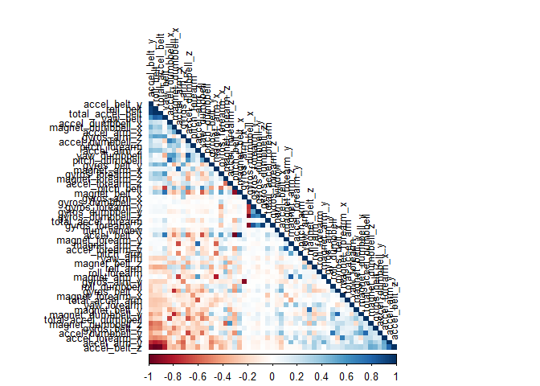
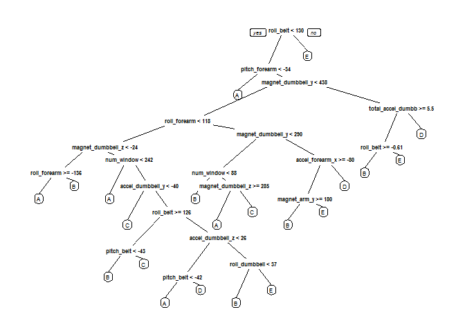

# Practical Machine Learning Course Project
James H. Baxter  
August 27, 2016  


## Introduction  

Using devices such as Jawbone Up, Nike FuelBand, and Fitbit it is now possible to collect a large amount of data about personal activity relatively inexpensively. These type of devices are part of the quantified self movement - a group of enthusiasts who take measurements about themselves regularly to improve their health, to find patterns in their behavior, or because they are tech geeks. One thing that people regularly do is quantify how much of a particular activity they do, but they rarely quantify how well they do it.  

The objective of this project is to use data from accelerometers on the belt, forearm, arm, and dumbell of 6 participants who were asked to perform barbell lifts correctly and incorrectly in 5 different ways. More information is available from the website here: http://groupware.les.inf.puc-rio.br/har (see the section on the Weight Lifting Exercise Dataset). An extract is provided below.  


Human activity recognition research has traditionally focused on discriminating between different activities, i.e. to predict "which" activity was performed at a specific point in time (like with the Daily Living Activities dataset above). The approach we propose for the Weight Lifting Exercises dataset is to investigate "how (well)" an activity was performed by the wearer. The "how (well)" investigation has only received little attention so far, even though it potentially provides useful information for a large variety of applications,such as sports training.

In this work (see the paper) we first define quality of execution and investigate three aspects that pertain to qualitative activity recognition: the problem of specifying correct execution, the automatic and robust detection of execution mistakes, and how to provide feedback on the quality of execution to the user. We tried out an on-body sensing approach (dataset here), but also an "ambient sensing approach" (by using Microsoft Kinect - dataset still unavailable)

Six young health participants were asked to perform one set of 10 repetitions of the Unilateral Dumbbell Biceps Curl in five different fashions: exactly according to the specification (Class A), throwing the elbows to the front (Class B), lifting the dumbbell only halfway (Class C), lowering the dumbbell only halfway (Class D) and throwing the hips to the front (Class E).

Class A corresponds to the specified execution of the exercise, while the other 4 classes correspond to common mistakes. Participants were supervised by an experienced weight lifter to make sure the execution complied to the manner they were supposed to simulate. The exercises were performed by six male participants aged between 20-28 years, with little weight lifting experience. We made sure that all participants could easily simulate the mistakes in a safe and controlled manner by using a relatively light dumbbell (1.25kg).  

## Project Objectives  

The goal of this machine learning project is to predict the manner in which the participants did the exercise based on any number of the variables from accelerometers on the belt, forearm, arm, and dumbbell of the 6 participants which are provided in the dataset.  

The value of this type of analysis is that the optimal ML model could theoretically be used with real-time accelerometer data to determine if an exercise regimen is being performed correctly, thereby improving the quality of the exercise.  

## Analysis Process  

### Weight Lifting Exercises Dataset  

The training data for this project is available here:  
https://d396qusza40orc.cloudfront.net/predmachlearn/pml-training.csv

The test data is available here:  
https://d396qusza40orc.cloudfront.net/predmachlearn/pml-testing.csv

The data for this project come from this source: http://groupware.les.inf.puc-rio.br/har. If you create a document from this source for any purpose please cite them as they have been very generous in allowing their data to be used for this kind of assignment.  

### Reproducability  

This analysis was performed with the popular 'R' programming language. All R code and settings will be included so that the results can be reproduced.  

The analysis was performed with:  
R Version 3.2.1  
RStudio Version 0.99.893  

The following R libraries were used:  


```r
# free up memory from any previous work
rm(list=ls())

# load the required libraries
library(caret)	# provides nearZeroVar function
```

```
## Warning: package 'caret' was built under R version 3.2.5
```

```
## Warning: package 'ggplot2' was built under R version 3.2.5
```

```r
library(rattle)
```

```
## Warning: package 'rattle' was built under R version 3.2.5
```

```r
library(corrplot)
```

```
## Warning: package 'corrplot' was built under R version 3.2.5
```

```r
library(rpart)
```

```
## Warning: package 'rpart' was built under R version 3.2.5
```

```r
library(rpart.plot)	# provides prp function
```

```
## Warning: package 'rpart.plot' was built under R version 3.2.5
```

Seed value for the pseudo-random generator:

```r
set.seed(12345)
```

### Importing the data  

Set a training and testing dataset URL:

```r
trainURL <- "http://d396qusza40orc.cloudfront.net/predmachlearn/pml-training.csv"
testURL <- "http://d396qusza40orc.cloudfront.net/predmachlearn/pml-testing.csv"
```

File retreival and reading. There is a 'training' dataset and a 20-row 'testing' set; the testing set will be set aside for validation testing after the model is built and optimized, so it will be called 'ValidSet'.  

```r
trainCSV <- "pml-training.csv"

if (file.exists(trainCSV)) {
        TrainSet <- read.csv(trainCSV, na.strings=c("NA","#DIV/0!",""))
} else { 
        download.file(trainURL,trainCSV)
        TrainSet <- read.csv(trainCSV, na.strings=c("NA","#DIV/0!",""))
        }                           

testCSV <-  "pml-testing.csv"

if (file.exists(testCSV)) {
        ValidSet <- read.csv(testCSV, na.strings=c("NA","#DIV/0!",""))
} else { 
        download.file(testURL,testCSV)
        ValidSet <- read.csv(testCSV, na.strings=c("NA","#DIV/0!",""))
}

# The next line can be un-commented to allow a summary investigation of the entire training dataset 
# str(TrainSet,list.len=length(TrainSet))

# An example of the str(TrainSet) output.
# Note that the first six columns are not usable metrics for prediction
# The last column 'classe' is the fashion of the exercise (A thru E) performed as described in the Introduction  

## 'data.frame':    19622 obs. of  160 variables:
##  $ X                       : int  1 2 3 4 5 6 7 8 9 10 ...
##  $ user_name               : Factor w/ 6 levels "adelmo","carlitos",..: 2 2 2 2 2 2 2 2 2 2 ...
##  $ raw_timestamp_part_1    : int  1323084231 1323084231 1323084231 1323084232 1323084232 1323084232 1323084232 1323084232 1323084232 1323084232 ...
##  $ raw_timestamp_part_2    : int  788290 808298 820366 120339 196328 304277 368296 440390 484323 484434 ...
##  $ cvtd_timestamp          : Factor w/ 20 levels "02/12/2011 13:32",..: 9 9 9 9 9 9 9 9 9 9 ...
##  $ new_window              : Factor w/ 2 levels "no","yes": 1 1 1 1 1 1 1 1 1 1 ...
##  $ num_window              : int  11 11 11 12 12 12 12 12 12 12 ...
##  $ roll_belt               : num  1.41 1.41 1.42 1.48 1.48 1.45 1.42 1.42 1.43 1.45 ...
##  $ pitch_belt              : num  8.07 8.07 8.07 8.05 8.07 8.06 8.09 8.13 8.16 8.17 ...
##  $ yaw_belt                : num  -94.4 -94.4 -94.4 -94.4 -94.4 -94.4 -94.4 -94.4 -94.4 -94.4 ...
##  $ total_accel_belt        : int  3 3 3 3 3 3 3 3 3 3 ...
##  $ kurtosis_roll_belt      : num  NA NA NA NA NA NA NA NA NA NA ...
##  $ kurtosis_picth_belt     : num  NA NA NA NA NA NA NA NA NA NA ...
##  ...
##  $ magnet_forearm_x        : int  -17 -18 -18 -16 -17 -9 -18 -9 -16 -22 ...
##  $ magnet_forearm_y        : num  654 661 658 658 655 660 659 660 653 656 ...
##  $ magnet_forearm_z        : num  476 473 469 469 473 478 470 474 476 473 ...
##  $ classe                  : Factor w/ 5 levels "A","B","C","D",..: 1 1 1 1 1 1 1 1 1 1 ...
```

### Cleaning the Data  

Investigation of the entire training dataset reveals there are quite a number of columns in which all or almost all values are missing (filled with 'NA'); columns missing at least 80% of usable values should be eliminated from the both the training and test datasets since they don't contribute to the prediction effort. The first five identification only columns should also be removed. Finally, any Near Zero Variance variables (those that are constant or nearly so) should be removed to reduce processing requirements and/or avoid hampering the model.


```r
# Remove the first five columns from each dataset
TrainSet <- TrainSet[, -(1:5)]
ValidSet <- ValidSet[, -(1:5)]

# Remove all the NA columns
AllNA <- sapply(TrainSet, function(x) mean(is.na(x))) > 0.8
TrainSet <- TrainSet[, AllNA==FALSE]
ValidSet <- ValidSet[, AllNA==FALSE]

# Check the new number of rows & columns for each set
dim(TrainSet)
```

```
## [1] 19622    55
```

```r
dim(ValidSet)
```

```
## [1] 20 55
```

```r
# Remove Near Zero Variance columns
NZV <- nearZeroVar(TrainSet)
TrainSet <- TrainSet[, -NZV]
ValidSet <- ValidSet[, -NZV]

# Check the final number of rows & columns for each set
dim(TrainSet)
```

```
## [1] 19622    54
```

```r
dim(ValidSet)
```

```
## [1] 20 54
```

```r
# Uncomment the next line to see what columns are left to be used for predictions
# str(TrainSet)
```

After the above data cleaning processes, the number of values to be used for the predictive analysis has been reduced to 19,622 observations of 54 variables.  

### Correlation Analysis  

A correlation analysis is conducted to determine if there are variables that are highly correlated and could be compacted using PCA (Pricipal Component Analysis) or similar techniques.


```r
corMatrix <- cor(TrainSet[, -54])
# FPC = first pricipal component order, color visualization, lower triangular matrix
corrplot(corMatrix, order="FPC", method="color", type="lower", tl.cex=0.8, tl.col=rgb(0,0,0))
```



The correlation matrix reveals some, but not an excessive, level of correlatation between some variables; these will be accounted for by including a PCA (Principal Control Analysis) as a preprocessing function while the model is being built. 

### Partitioning a Testing and Training Dataset  

The large training dataset will be sub-divided into 60% training and a 40% testing datasets.  


```r
inTrain <- createDataPartition(y=TrainSet$classe, p=0.6, list=FALSE)
pTrain <- TrainSet[inTrain,]
pTest <- TrainSet[-inTrain,]

# Count of the rows in each set 
dim(pTrain)
```

```
## [1] 11776    54
```

```r
dim(pTest)
```

```
## [1] 7846   54
```

```r
# str(pTrain,list.len=length(pTrain))
```

### Create and Train Multiple Models

The TrainControl feature of the 'caret' package for R will be set to perform a 7-fold cross validation whilst training each model in order to avoid overfitting on the training data and to reduce out-of-sample errors. In addition, the "pca" option will be invoked to perform Principal Component Analysis with default settings on the training data to compact any variable correlations.  

Six models were fitted: Random Forest, Support Vector Machine (SVM) with the Radial Basis Function (RBF) kernel, SVM with a linear kernel, Neural Network, Bayes Generalized Linear Model (GLM), and the boosting algorithm LogitBoost. The results of each model will then be compared to allow selection of the best choice for predictions.  


```r
# trainControl 'cv' option specified a k-fold cross-validation with number of times = 7
# preProcOptions = "pca" specifies the use of Pricincipal Control Analysis to compact highly correlated variables
# 
tc <- trainControl(method="cv", number = 7, verboseIter=FALSE, preProcOptions="pca", allowParallel=TRUE)
```


```r
rf <- train(classe ~ ., data=pTrain, method="rf", trControl=tc)
```


```r
svmr <- train(classe ~ ., data=pTrain, method="svmRadial", trControl=tc)
```


```r
svml <- train(classe ~ ., data=pTrain, method="svmLinear", trControl=tc)
```


```r
NN <- train(classe ~ ., data=pTrain, method="nnet", trControl=tc, trace=FALSE, verbose=FALSE)
```


```r
# install.packages("arm") doesn't work - use:
# install.packages("arm", repos="http://R-Forge.R-project.org")
bayesglm <- train(classe ~ ., data=pTrain, method="bayesglm", trControl=tc)
```


```r
logitboost	<- train(classe ~ ., data=pTrain, method="LogitBoost", trControl=tc)
```

### Cross Validation to Compare Accuracy Between Models

The accuracy and 'Kappa' statistics (a metric that compares an observed accuracy with an expected accuracy (random chance)) were extracted for each model; we will consider an accuracy and/or kappa of < .80 to identify an unusable model.  


```r
models <- c("Random Forest", "SVM (radial)", "SVM (linear)", "Neural Net", "Bayes GLM", "LogitBoost")

Accuracy <- c(max(rf$results$Accuracy),
        max(svmr$results$Accuracy),
        max(svml$results$Accuracy),
        max(NN$results$Accuracy),
        max(bayesglm$results$Accuracy),
				max(logitboost$results$Accuracy))
        
Kappa <- c(max(rf$results$Kappa),
        max(svmr$results$Kappa),
        max(svml$results$Kappa),
        max(NN$results$Kappa),
        max(bayesglm$results$Kappa),  
        max(logitboost$results$Kappa))

performance <- cbind(models,Accuracy,Kappa)
# Dispay performance comparison
performance
```

```
##      models          Accuracy            Kappa              
## [1,] "Random Forest" "0.996518305193648" "0.995596051083372"
## [2,] "SVM (radial)"  "0.921962097458015" "0.901171945541545"
## [3,] "SVM (linear)"  "0.786597635092452" "0.728613747726942"
## [4,] "Neural Net"    "0.388160651981095" "0.221375042721722"
## [5,] "Bayes GLM"     "0.405995324841161" "0.240249849484225"
## [6,] "LogitBoost"    "0.925959300314797" "0.905866993742675"
```

Random Forest provided the best accuracy results, so it will be used to test prediction accuracy against the testing dataset.  

### Testing Model Accuracy  

A Confusion Matrix will be used to compare the prediciton results from the Random Forest model against the identified classes in the testing dataset.  


```r
rfTest <- predict(rf, pTest)
CM <- confusionMatrix(rfTest, pTest$classe)
CM
```

```
## Confusion Matrix and Statistics
## 
##           Reference
## Prediction    A    B    C    D    E
##          A 2232    2    0    0    0
##          B    0 1512    2    0    2
##          C    0    4 1366    9    0
##          D    0    0    0 1276    2
##          E    0    0    0    1 1438
## 
## Overall Statistics
##                                           
##                Accuracy : 0.9972          
##                  95% CI : (0.9958, 0.9982)
##     No Information Rate : 0.2845          
##     P-Value [Acc > NIR] : < 2.2e-16       
##                                           
##                   Kappa : 0.9965          
##  Mcnemar's Test P-Value : NA              
## 
## Statistics by Class:
## 
##                      Class: A Class: B Class: C Class: D Class: E
## Sensitivity            1.0000   0.9960   0.9985   0.9922   0.9972
## Specificity            0.9996   0.9994   0.9980   0.9997   0.9998
## Pos Pred Value         0.9991   0.9974   0.9906   0.9984   0.9993
## Neg Pred Value         1.0000   0.9991   0.9997   0.9985   0.9994
## Prevalence             0.2845   0.1935   0.1744   0.1639   0.1838
## Detection Rate         0.2845   0.1927   0.1741   0.1626   0.1833
## Detection Prevalence   0.2847   0.1932   0.1758   0.1629   0.1834
## Balanced Accuracy      0.9998   0.9977   0.9983   0.9960   0.9985
```

The prediction accuracy was very high with the Random Forest model (99.72%), so it will be used to predict the class outcomes against the validation dataset.  

### Out of Sample Error  

The estimated Out of Sample Error (error rate of predicting outcomes on the testing dataset, which the model was not trained on) is calculated here:  


```r
OOSErr <- (1 - CM$overall['Accuracy']) * 100
OOSErr <- round(OOSErr, digits=2)
paste0("Out of sample error estimation: ", OOSErr, "%")
```

```
## [1] "Out of sample error estimation: 0.28%"
```

### Random Forest Decision Tree Graphic  

An interesting graphic is the visualization of a Random Forest decision tree for the testing dataset:  


```r
modelFit <- rpart(classe ~., data=pTest, method="class")
prp(modelFit)
```



### Predicting Classes from the Validation Dataset  

A requirement for completion of the Coursera Machine Learning course is to submit the prediction results for the validation test data; the results provided here will be used.  


```r
validTest <- predict(rf, ValidSet)
validTest
```

```
##  [1] B A B A A E D B A A B C B A E E A B B B
## Levels: A B C D E
```

The validation test data did not include the exercise 'classe' values; this was a test to see if the analysis process created a valid prediction model. The submission of the prediction results to the Coursera test website returned a score of 100% correct results, so the model must have been accurate enough to correctly predict the validation data outcomes.  

__END__

